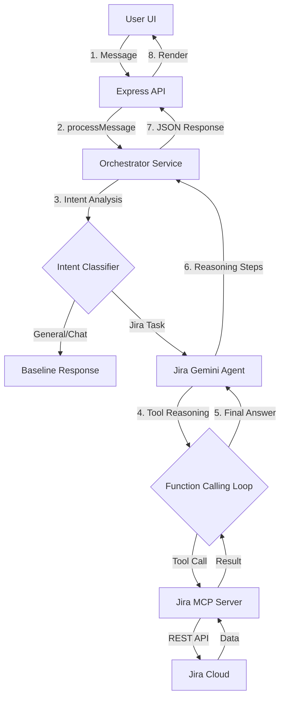

<div align="center">

# 🚀 JIRA-AI
**Transparent Reasoning & Parallel Execution Agent**

[](https://www.typescriptlang.org/)
[](https://ai.google.dev/)
[](https://opensource.org/licenses/ISC)

<br />


<br />

### *A state-of-the-art, premium AI agent for Jira management. Built for speed, transparency, and a "WOW" SaaS experience.*

---

</div>

## 🌟 Key Features (v10)

- **Execution Logs (Transparency)**: Watch the agent's "Internal Thoughts" in real-time. No more guessing—see exactly which JQL is being run or which task is being updated.
- **Parallel Tooling (Performance)**: Handles complex, multi-action requests (e.g., "Create 3 tickets and move KAN-5 to Done") in a single parallel execution pass.
- **Agent-Grade Data**: Automated Markdown Table generation for all summaries and task lists.
- **Premium Glassmorphism**: A stunning, curvy UI with deep shadows, translucency, and organic animations.
- **Active Task Scroller**: Professional-grade task management sidebar that stays synced with your assigned Jira issues.

## 🎯 User Capabilities & Command Reference

The JIRA-AI agent is designed to handle natural language as if you were talking to a project manager. Below is the full matrix of supported actions.

### 1. Capability Matrix
| Action | Example Command | Data Extracted |
| :--- | :--- | :--- |
| **Search Tickets** | "Find all high priority bugs in KAN project" | JQL: `project=KAN AND priority=High AND type=Bug` |
| **Summarize Work**| "Give me a summary of my assigned tasks" | Identity-linked JQL + AI Summary Table |
| **Create Issue** | "Create a story in APP: Add login with Google" | Summary: "Add login with Google", Type: Story, Project: APP |
| **Update Status** | "Move APP-123 to In Progress" | IssueKey: APP-123, TargetStatus: "In Progress" |
| **Add Comment** | "Tell the team on KAN-5 that the API is ready" | IssueKey: KAN-5, Text: "the API is ready" |
| **Assign User** | "Assign KAN-10 to Himanshu" | Calls `searchUser` -> extracts AccountId -> `updateIssue` |


*Modern, Glassmorphic AI Command Center for Jira*

A state-of-the-art, premium AI agent for Jira management. Built for speed, transparency, and a "WOW" SaaS experience.

## 🌟 Key Features (v10)

- **Execution Logs (Transparency)**: Watch the agent's "Internal Thoughts" in real-time. No more guessing—see exactly which JQL is being run or which task is being updated.
- **Parallel Tooling (Performance)**: Handles complex, multi-action requests (e.g., "Create 3 tickets and move KAN-5 to Done") in a single parallel execution pass.
- **Agent-Grade Data**: Automated Markdown Table generation for all summaries and task lists.
- **Premium Glassmorphism**: A stunning, curvy UI with deep shadows, translucency, and organic animations.
- **Active Task Scroller**: Professional-grade task management sidebar that stays synced with your assigned Jira issues.

## 🎯 User Capabilities & Command Reference

The JIRA-AI agent is designed to handle natural language as if you were talking to a project manager. Below is the full matrix of supported actions.

### 1. Capability Matrix
| Action | Example Command | Data Extracted |
| :--- | :--- | :--- |
| **Search Tickets** | "Find all high priority bugs in KAN project" | JQL: `project=KAN AND priority=High AND type=Bug` |
| **Summarize Work**| "Give me a summary of my assigned tasks" | Identity-linked JQL + AI Summary Table |
| **Create Issue** | "Create a story in APP: Add login with Google" | Summary: "Add login with Google", Type: Story, Project: APP |
| **Update Status** | "Move APP-123 to In Progress" | IssueKey: APP-123, TargetStatus: "In Progress" |
| **Add Comment** | "Tell the team on KAN-5 that the API is ready" | IssueKey: KAN-5, Text: "the API is ready" |
| **Assign User** | "Assign KAN-10 to Himanshu" | Calls `searchUser` -> extracts AccountId -> `updateIssue` |

### 2. Smart Extraction Logic
- **Auto-Summarization**: If you send a long paragraph about a bug, JIRA-AI automatically distills it into a professional 5-word title for the ticket and keeps the original text as the description.
- **Priority Detection**: Words like "urgent", "critical", or "p1" automatically set the ticket priority to **Highest**.
- **Contextual Memory**: The agent remembers which ticket you were just talking about. If you say "Move it to Done", it knows "it" refers to the last ticket mentioned in the conversation.

### 3. Categorized Examples
#### 🔍 Discovery
- "Show me all tickets updated today"
- "Are there any blocked stories in the backlog?"
- "Find tickets created by Himanshu"

#### 📝 Management
- "Change the priority of KAN-22 to Low"
- "Move KAN-44 to In Review"
- "Create a new Task: Setup Redis database connection"

#### 👤 Collaboration
- "Who is assigned to APP-9?"
- "Assign the login bug to myself"
- "Search for a user named 'John Doe'"

## 🏗️ System Architecture & Logic

JIRA-AI uses a **Dual-Agent Architecture** to deliver high-precision results and zero-latency feedback.

### 1. The Request Flow


### 2. The Orchestrator (Intent Layer)
The Orchestrator is the "Brain" that classifies your goal before executing any Jira tasks. This ensures "Hello" messages are handled instantly without token waste.

| Intent | Trigger Logic |
| :--- | :--- |
| `SEARCH_JIRA` | "What is the status of...", "Find all bugs..." |
| `CREATE_TICKET` | "Make a new story...", "Report a bug..." |
| `ADD_COMMENT` | "Put a comment on...", "Tell the team that..." |
| `UPDATE_TICKET` | "Move KAN-5 to Done", "Change priority to High" |
| `CLEAR_MEMORY` | "Forget everything", "Clear session" |

### 3. The Jira Specialist (Execution Layer)
Once an intent is flagged, the agent enters a **Multi-Turn Reasoning Loop**:
- **Parallel Tool Execution**: When you request multiple actions, the agent generates parallel function calls executed concurrently via `Promise.all`.
- **Reasoning Logs**: Every internal tool pick generates a step description (e.g., `🔍 Searching Jira...`) which is streamed to your **Execution Logs** console for 100% transparency.

## 🛠️ Technology Stack

- **Backend**: Node.js, TypeScript, Express, @google/genai (Gemini 2.0), Redis (for session memory).
- **Frontend**: React, Framer Motion (Animations), Lucide (Iconography), Zustand (State), Axios.
- **Integration**: Jira Cloud API via custom MCP (Model Context Protocol) patterns.

## 🚀 Getting Started

### Prerequisites
- Node.js 20+
- A Jira Cloud instance with API permissions.
- A Google Gemini API Key.

### Installation
1.  **Clone** the repository.
2.  **Configure `.env`** (Root and Frontend):
    ```env
    # Root .env
    GEMINI_API_KEY=your_key
    JIRA_API_URL=https://your-domain.atlassian.net
    JIRA_USER_EMAIL=your@email.com
    JIRA_API_TOKEN=your_token
    # Optional security
    AGENT_SECRET_TOKEN=premium_secret_123
    ```
3.  **Install dependencies**:
    ```bash
    npm install
    npm install --prefix frontend
    ```
4.  **Run Development Mode**:
    ```bash
    npm run dev
    ```
---
